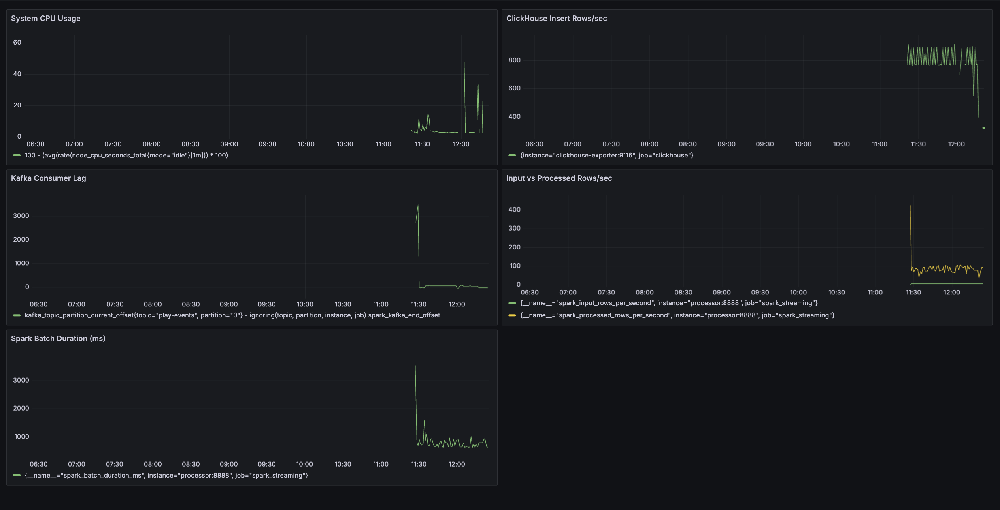
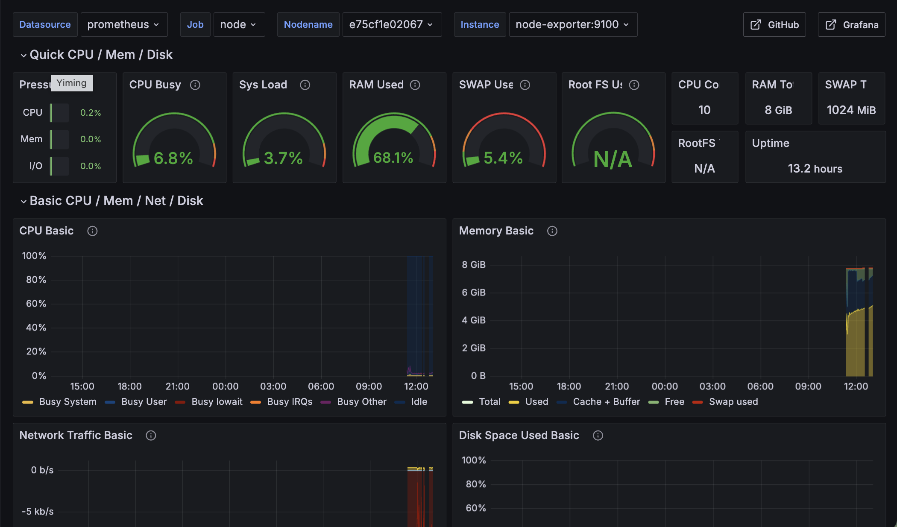
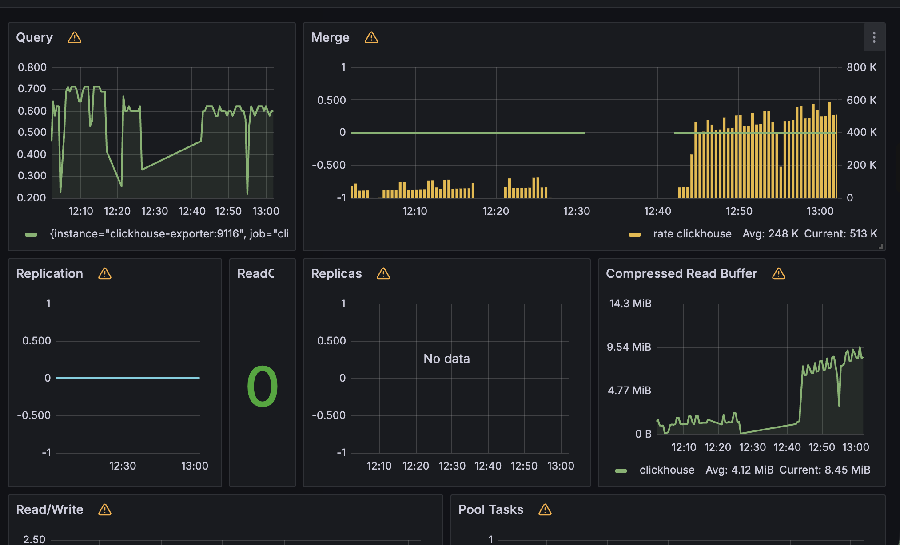

# Spotify Trending Songs — Real-Time Data Pipeline

A production-grade real-time data pipeline simulating Spotify's trending songs system, based on the system design from [Build Moat](https://buildmoat.org).

## System Architecture

**Streaming (Real-time):**
```
Producer → Kafka → Spark Structured Streaming → ClickHouse (play_counts_1m) → Redis Cache → FastAPI
                                              → Iceberg on MinIO (play_facts, historical)
```

**Batch (Daily):**
```
Airflow DAG (daily @ 1AM) → Trino → Iceberg (play_facts) → ClickHouse (daily_trending) → FastAPI
```

### Architecture Diagram

```
┌─────────────┐     ┌─────────────┐     ┌─────────────────────────┐
│   Producer  │────▶│    Kafka    │────▶│  Spark Structured       │
│  (Python)   │     │  (Message   │     │  Streaming (Processor)  │
└─────────────┘     │   Queue)    │     │  - Deduplication        │
                    └─────────────┘     │  - Session Tracking     │
                                        │  - 30s Play Threshold   │
                                        └────────┬────────────────┘
                                                 │
                                    ┌────────────┴────────────┐
                                    ▼                         ▼
                         ┌─────────────────┐      ┌─────────────────┐
                         │   ClickHouse    │      │  Iceberg on     │
                         │  play_facts     │      │  MinIO          │
                         │  (7-day TTL)    │      │  play_facts     │
                         │  play_counts_1m │      │  (永久保留)      │
                         │  daily_trending │      └────────┬────────┘
                         └────────┬────────┘               │
                                  │                         ▼
                                  │               ┌─────────────────┐
                                  │               │     Trino       │
                                  │               └────────┬────────┘
                                  │                        │
                                  │               ┌────────▼────────┐
                                  │               │  Airflow DAG    │
                                  │               │  (daily @ 1AM)  │
                                  │               └────────┬────────┘
                                  │                        │
                                  │◀───────────────────────┘
                                  │
                    ┌─────────────┘
                    ▼
          ┌─────────────────┐
          │  Redis Cache    │
          └────────┬────────┘
                   │
                   ▼
          ┌─────────────────┐
          │    FastAPI      │
          │  (Top K API)    │
          └─────────────────┘
```

## System Design

### Functional Requirements
1. Collect listening metrics from clients
2. Provide Top K songs by different dimensions (country, genre)
3. Generate daily trending report

### Non-Functional Requirements
1. High accuracy — count a play only after 30 seconds of listening
2. Low latency — Top K results updated every minute via Materialized View

### Production Considerations
1. Scale to 700M MAUs (~1.2M events/sec) — requires horizontal scaling of Kafka partitions, Spark executors, and ClickHouse shards
2. Generate Top K results ASAP after each hour/day ends — would require windowed aggregation triggers rather than fixed 1AM batch

### Key Design Decisions

#### Effective Play Count
Following Spotify's official definition, a stream is counted when a listener plays a song for at least 30 seconds.

Implemented via Spark `applyInPandasWithState`:
- Per-session state tracks `accumulated_ms`
- PlayFact emitted once when `accumulated_ms >= 30,000ms`
- `play_fact_emitted` flag prevents duplicate counting within the same session

`applyInPandasWithState` was chosen over `mapGroupsWithState` because it allows yielding multiple rows per group update and integrates naturally with pandas, making the session logic easier to reason about.

#### Hot / Cold Data Tiering
Raw `play_facts` are written to two destinations simultaneously:

- **ClickHouse** (`play_facts`, 7-day TTL) — serves as the source for `play_counts_1m` Materialized View, enabling real-time Top K queries with low latency
- **Iceberg on MinIO** (`play_facts`, permanent) — long-term historical storage, queried by Trino for the daily batch pipeline

This separation keeps ClickHouse lean (only recent data) while preserving full history in the lakehouse for analytics.

#### Lakehouse Architecture
Iceberg on MinIO provides an open table format for historical data:
- **Open standard** — Spark writes, Trino reads, no vendor lock-in
- **Partitioned** by `days(event_timestamp)` and `country` for efficient time-range and country-level queries
- **REST Catalog** (`tabulario/iceberg-rest`) manages table metadata, simpler than Hive Metastore for self-hosted setups

#### Writing to ClickHouse via `foreachPartition`
Rather than using `foreach` (which creates one connection per row), the processor uses `foreachPartition` to batch all rows in a partition into a single INSERT. This avoids driver OOM issues and reduces connection overhead significantly.

#### OLAP Storage
ClickHouse with column-oriented storage for efficient analytical queries:
- `play_facts` — raw PlayFact events (7-day TTL, source for Materialized View)
- `play_counts_1m` — Materialized View aggregated by minute using `SummingMergeTree`
- `daily_trending` — pre-aggregated daily Top 10 by country and genre, populated by Airflow via Trino

ClickHouse was chosen over cloud-native OLAP (e.g. BigQuery) because this project is designed to be fully self-hosted and runnable with a single `docker compose up`. In a production cloud environment, BigQuery or Redshift would be natural alternatives.

#### Redis Cache (Cache-Aside Pattern)
FastAPI uses a cache-aside pattern with 60s TTL:
1. Check Redis for cached result
2. On cache miss, query ClickHouse and write result to Redis
3. Subsequent requests within TTL are served from Redis

This avoids repeated ClickHouse aggregation queries for the same Top K parameters.

#### Airflow Batch Pipeline
A daily Airflow DAG runs at 1AM to compute the previous day's Top 10 trending songs:
- `check_connections` — verifies both ClickHouse and Trino are reachable
- `create_daily_trending_table` — idempotent table creation
- `compute_daily_trending` — queries `iceberg.spotify.play_facts` via Trino, writes results to ClickHouse `daily_trending`

Using Trino to query Iceberg separates the batch analytics path from the real-time query path, keeping ClickHouse focused on low-latency serving.

#### Spark Consumer Lag Monitoring
Spark Structured Streaming does not register a consumer group with Kafka — it manages offsets via checkpoint. Traditional Kafka monitoring tools (e.g. Burrow, kafka-exporter) cannot observe consumer lag from the broker side.

A custom `StreamingQueryListener` exposes `startOffset` and `endOffset` per batch to Prometheus, allowing consumer lag to be derived as `kafka_current_offset - spark_end_offset`.

#### Hot Shard Simulation
Producer simulates real-world traffic distribution:
- US: 28%, BR: 10%, UK: 8%, TW: 2%, etc.
- Demonstrates the hot shard problem where high-volume partitions cause uneven Kafka consumer load
- Production mitigation: salting (adding random suffix to partition key) to distribute hot keys across multiple partitions

## Components

| Component | Tool | Role |
|---|---|---|
| Producer | Python + kafka-python | Simulates client sending play events |
| Message Queue | Kafka + Zookeeper | Event buffer and delivery |
| Stream Processor | PySpark Structured Streaming | Dedup + session tracking + PlayFact |
| OLAP | ClickHouse | Real-time aggregated Top K storage (7-day TTL) |
| Lakehouse | Iceberg on MinIO | Historical play_facts (permanent) |
| Query Engine | Trino | SQL queries on Iceberg for batch pipeline |
| Cache | Redis | Query result caching (cache-aside) |
| API | FastAPI | Top K query endpoint |
| Batch Scheduler | Airflow | Daily trending report pipeline |
| Monitoring | Prometheus + Grafana | Metrics collection and visualization |

## Monitoring

The pipeline is monitored with Prometheus and Grafana. Metrics are collected from Kafka, ClickHouse, the host system, and Spark Structured Streaming via a custom `StreamingQueryListener`.

**Spark Streaming Dashboard** — batch duration, consumer lag, input/processed rows/sec, ClickHouse insert rate, CPU usage



**Node Exporter Dashboard** — CPU, memory, disk, network



**ClickHouse Dashboard** — query rate, merge activity, read/write, compressed buffer



## API Endpoints

### GET /top_tracks
Returns Top K trending songs by dimension.
```
GET /top_tracks?dim={dim}&num_tracks={num_tracks}&window={window}
```

**Parameters:**
| Parameter | Type | Options | Default |
|---|---|---|---|
| `dim` | string | `country`, `genre` | required |
| `num_tracks` | integer | 1-100 | 10 |
| `window` | string | `1h`, `1d` | `1h` |

**Example:**
```bash
curl "http://localhost:8000/top_tracks?dim=country&num_tracks=10&window=1h"
```

**Response:**
```json
{
  "source": "cache",
  "data": [
    {
      "rank": 1,
      "track_id": "track_30",
      "title": "Programmable client-driven standardization",
      "dimension": "US",
      "total_plays": 12
    }
  ]
}
```

`source` indicates whether the result was served from `cache` (Redis) or `clickhouse` (cache miss).

## Quick Start

Once all services are up, the pipeline runs automatically:

1. **Producer** continuously sends simulated play events to Kafka
2. **Spark** consumes from Kafka, tracks each session's listening time, and emits a PlayFact once a user has listened for 30 seconds
3. **ClickHouse** stores the PlayFacts and aggregates them by minute via a Materialized View; raw data expires after 7 days
4. **Iceberg on MinIO** stores all PlayFacts permanently for historical analysis
5. **FastAPI** serves real-time Top K queries, backed by Redis cache
6. **Airflow** runs a daily batch job at 1AM — queries Iceberg via Trino, writes Top 10 to ClickHouse

### Prerequisites
- Docker + Docker Compose
- Git

### Run
```bash
git clone https://github.com/Brady-Huang/spotify-trending.git
cd spotify-trending

docker compose up -d
```

> Services may take 2-3 minutes to fully start. Use `docker compose ps` to check status.

Airflow is automatically initialized on first run. Login at http://localhost:8090 with `admin / admin`.

### Verify It's Working

Follow the data flow step by step:

**1. Check producer is sending events**
```bash
docker compose logs -f producer
```
You should see play events being emitted every few seconds.

**2. Check processor is consuming from Kafka**
```bash
docker compose logs -f processor
```
You should see both ClickHouse and Iceberg write logs.

**3. Check Spark Structured Streaming**

Open http://localhost:4040 → Structured Streaming tab. You should see input/processing rate and batch progress.

**4. Query the Top K API**
```bash
curl "http://localhost:8000/top_tracks?dim=country&num_tracks=5&window=1h"
```

**5. Explore ClickHouse directly**

Open http://localhost:8123/play to run queries in the browser:

```sql
-- Confirm data is flowing in
SELECT count() FROM play_facts

-- Real-time play counts per minute (Materialized View)
SELECT window_start, sum(play_count) AS plays
FROM play_counts_1m
GROUP BY window_start
ORDER BY window_start DESC
LIMIT 10

-- Daily trending results (after triggering Airflow DAG)
SELECT * FROM daily_trending
WHERE report_date = today()
ORDER BY rank ASC
```

**6. Query Iceberg via Trino**
```bash
docker compose exec trino trino --execute "SELECT count(*) FROM iceberg.spotify.play_facts"
docker compose exec trino trino --execute "SELECT country, count(*) as plays FROM iceberg.spotify.play_facts GROUP BY country ORDER BY plays DESC LIMIT 5"
```

**7. Trigger the daily batch DAG manually**

Open http://localhost:8090, find `daily_trending_report`, and trigger it manually. Once complete, verify results:
```bash
curl "http://localhost:8123/?query=SELECT%20*%20FROM%20daily_trending%20ORDER%20BY%20dimension_type%2C%20rank%20ASC%20LIMIT%2020"
```

**8. View monitoring dashboards**

Open http://localhost:3000 (Grafana) with `admin / admin`. Import dashboards:
- Spark Streaming Dashboard (custom)
- Node Exporter Full: ID `1860`
- ClickHouse: ID `882`

**9. Explore MinIO**

Open http://localhost:9001 with `minioadmin / minioadmin`. Browse `warehouse/spotify/play_facts/` to see Iceberg `data/` and `metadata/` directories.

### Service URLs

| Service | URL |
|---|---|
| FastAPI | http://localhost:8000 |
| API Docs | http://localhost:8000/docs |
| Spark Master UI | http://localhost:8080 |
| Spark Application UI | http://localhost:4040 |
| Airflow UI | http://localhost:8090 |
| ClickHouse | http://localhost:8123 |
| MinIO Console | http://localhost:9001 |
| Trino | http://localhost:8081 |
| Grafana | http://localhost:3000 |
| Prometheus | http://localhost:9090 |

### Stop
```bash
docker compose down
```

### Restart
```bash
docker compose up -d
```

> **Note:** Checkpoint data is persisted in Docker volumes. On restart, the stream processor will resume from the last committed Kafka offset.

## Project Structure
```
spotify-trending/
├── producer/
│   ├── producer.py          # Simulates play events with weighted country distribution
│   └── Dockerfile
├── processor/
│   ├── stream_processor.py  # PySpark Structured Streaming main entry point
│   ├── clickhouse_writer.py # ClickHouse init and write logic (foreachPartition)
│   ├── iceberg_writer.py    # Iceberg REST catalog config and write logic
│   ├── metrics.py           # Prometheus StreamingQueryListener
│   └── Dockerfile
├── api/
│   ├── main.py              # FastAPI Top K endpoint with Redis cache-aside
│   └── Dockerfile
├── airflow/
│   ├── Dockerfile
│   └── dags/
│       └── daily_trending.py  # Queries Iceberg via Trino, writes to ClickHouse
├── spark/
│   └── Dockerfile
├── trino/
│   └── catalog/
│       └── iceberg.properties  # Trino Iceberg connector config
├── monitoring/
│   └── prometheus.yml
├── docs/
│   └── images/
├── terraform/
│   ├── main.tf
│   ├── variables.tf
│   ├── outputs.tf
│   └── startup.sh
├── docker-compose.yml
└── README.md
```

## ClickHouse Schema

### play_facts (Hot Storage, 7-day TTL)
```sql
CREATE TABLE play_facts (
    session_id      String,
    user_id         String,
    track_id        String,
    title           String,
    genre           String,
    country         String,
    is_valid        UInt8,
    event_timestamp DateTime64(3, 'Asia/Taipei')
) ENGINE = MergeTree()
ORDER BY (event_timestamp, country, genre)
TTL toDate(event_timestamp) + INTERVAL 7 DAY
```

### play_counts_1m (Materialized View)
```sql
CREATE MATERIALIZED VIEW play_counts_1m
ENGINE = SummingMergeTree()
ORDER BY (window_start, track_id, country, genre)
AS SELECT
    toStartOfMinute(event_timestamp) AS window_start,
    track_id, title, genre, country,
    count() AS play_count
FROM play_facts
WHERE is_valid = 1
GROUP BY window_start, track_id, title, genre, country
```

### daily_trending (Batch Output)
```sql
CREATE TABLE daily_trending (
    report_date     Date,
    dimension_type  String,
    dimension_value String,
    track_id        String,
    title           String,
    total_plays     UInt64,
    rank            UInt32
) ENGINE = MergeTree()
ORDER BY (report_date, dimension_type, rank)
```

## Iceberg Schema

### play_facts (Cold Storage, Permanent)
```sql
CREATE TABLE iceberg.spotify.play_facts (
    session_id      STRING,
    user_id         STRING,
    track_id        STRING,
    title           STRING,
    genre           STRING,
    country         STRING,
    is_valid        INT,
    event_timestamp TIMESTAMP
)
USING iceberg
PARTITIONED BY (days(event_timestamp), country)
```

## Deploy to GCP

```bash
cd terraform
terraform init
terraform apply
```

Resources created: VPC, subnet, firewall, static IP, GCS bucket, GCE VM (e2-standard-4).
The VM automatically clones this repo and runs `docker compose up` on startup.

## Capacity Estimation

Based on 700M MAUs with 20% daily active users:

Assumptions:
- 20% DAU rate → 140M daily active users
- DAU distributed evenly across 24 hours → at any given hour, 1/24 of DAU are active
- Each active user generates 1 event every 5 seconds

```
700M × 20% ÷ 24hr × 3600s/hr ÷ 5s/event
= ~4.2 Billion events/hour
= ~1.2 Million events/second
```

This project simulates the architecture at this scale. The local Docker Compose setup is for development and demonstration purposes. In a real deployment, Kafka partitions, Spark workers, and ClickHouse shards would scale horizontally to handle ~1.2M events/sec.